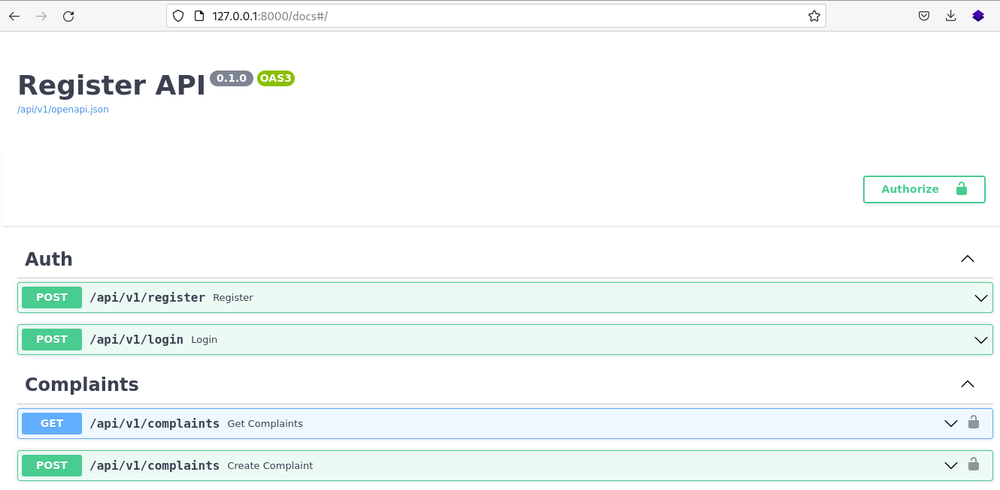

# Micro services with FastAPI


FastAPI is a Web framework for developing RESTful APIs in Python. FastAPI is based on Pydantic and type hints to validate, serialize, and deserialize data, and automatically auto-generate OpenAPI documents

## Steps for running project
1. Create and activate a virtual environment. (The next commands if for unix systems). Then you must install the requirements 
```
#create
python3 -m venv venv

#activate
source venv/bin/activate

#install requirements

pip install -r requirements.txt

```
   
2. Setup credentiasl for db. Replace .env-dev for .env and put the credentials in this file.
Please, ensure provide all values
```
DB_USER=
DB_PASSWORD=
DB_NAME=
DB_HOST=
DB_PORT=

JWT_SECRET=
API_V1_STR='/api/v1'
  
PROJECT_NAME='Project Name'
PROJECT_VERSION='1.0'
```
> Note: If you don't have a bd server, you can use the docker-compose.yml file to setup a postgres server.

3. Create db schema. Execute the following commands:
```
alembic upgrade head
```
   
4. Create a admin user. For this step, execute the followin commands

```
# with the terminal in the project root directory
export PYTHONPATH=$PWD
# Next, execute the comand with the following options
python3 commands/create_super_user.py -f 'firtsname' -l 'lastname' 
-e 'email' -p 'phone' -i 'iban' -pw 'password'

```
> Note: Replace firstname, lastame, email, phone, iban and password with your data

5. Run the server
```
uvicorn main:app --reload
```

6. Open your web server al http://127.0.0.1:8000/docs
   


7. Test the endpoints